## `🤖 About.Me`
<!-- it works in VSCodium... don't know why GitHub doesn't allow it... leave it here for later.
  <a href="https://github.com/milanatran">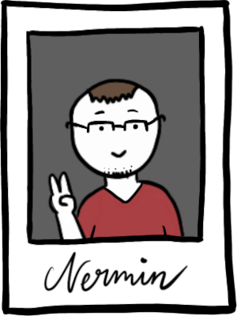</a>
  -->
  Hi, I'm Nermin, also called Nico, studying International Media & Informatics (IMI) in the 6th semester. Learning is the most important skill, and I believe that doing so in a playful, curiosity-driven way is the most effective and natural. Therefore, I aspire to a career in serious games. Games are also a cornucopia of software engineering topics; varied, versatile, challenging and engaging enough to never get bored.

While learning the ropes of full-stack development, I explore how gamification can be used for positive societal changes and businesses, and against dark-patterns and unethical practices.

Working as a student tutor in '22 & '23, gaining experience in didactics, and expanding my skills, so I'll be able to design even greater gaming and learning opportunities after my graduation.

###  <a href="mailto:n-c0de-r_contact@e.mail.com?subject=Hello from GitHub">`📧 Contact.Me`</a>

<details>
      <summary>additional.info</summary>

- 🔭 When I'm not preparing classes or tutoring, I try to learn more about Game Based Learning.
- 🎮 Learning Godot & GDScript, Unity & C#. Since I see myself in EduTech and Gamification.
      Currently doing courses on game engines, physics and AI, while fidgeting with some projects in my free time to show the skills.
- 🌱 Into Web Dev + JS too, and gained experience with TypeScript. Would love to make more cross-platform web apps.
- 👯 Starting my internship abroad in winter '23, making Serious Games with [RisingPixel](https://www.risingpixel.com/) and hoping for a long-term working student opportunity after that.
- 💬 Ask me about pixelart, edutech, good storytelling & game design. I'm a beginner, but passionate about these.

### Other than that I'm striving to make my graduation in...
[](https://github.com/milanatran)

[](https://imi-bachelor.htw-berlin.de)
</details>

<br />

###  `💾 Knowledge.Set`


<br /><br />

[](https://n-c0de-r.github.io)

---

## `⚗️ Recent.Projects:`
For a more detailed description and implementation details, click the title or the icon to open the respective repo.

#
[I Can't C# (Unity / C#)](https://github.com/ChariotGames/I-Cant-C-Sharp)

[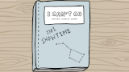](https://github.com/ChariotGames/I-Cant-C-Sharp)
No, it is NOT a C# learning app!<br>Part of the <a href="https://showtime.f4.htw-berlin.de">summer of '23 bachelor's showtime</a> project topic "Fostering concentration through minigames". But we flipped it and instead, we "challange" the concentration of the player.

```
As team member of Chariot Games:
Unity guidance, backend coding, code style & design, base game class, minigame manager, simon says game, bug fixing, code & scene cleanup, documentation, progress management.
```

#
[MCE-Translator  (Unity / C#)](https://github.com/SilenceBreakers/NUI-MCE-Translator)

[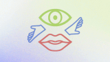](https://github.com/SilenceBreakers/NUI-MCE-Translator)

A Unity-based prototype application that allows users to use sign language gestures for vowels and numbers to translate them to text on screen and speech to audio.

```
As team member of SilenceBreakers:
Mostly backend work and Unity guidance, also programming a gesture recorder.
```

#
[WaveMaker (Unity / C#)](https://github.com/IMIaculate-Games/WaveMaker)

[](https://github.com/IMIaculate-Games/WaveMaker)

A reverse tower defense game for the topic "Reversed Roles" of <a href="https://itch.io/jam/gmtk-2023">GMTK Game Jam 23</a> where you create and play the waves.

```
As team member of IMIaculate-Games:
Random tower placement script, Unity teaching, GUI setup and editing, various bugfixes.
```

#
[StegaNotes (HTML5 / JS)](https://github.com/StegaNotes)

[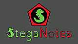](https://github.com/StegaNotes)

An offline-first, minimalistic Note-taking cross-platform PWA, that is able to hide texts using steganography. Made and works without frameworks or other heavy-weight "help" to reduce data load.

```
By me:
Idea, design, implementation, art retouch, UI, documentation.
```

#
[NightLifeDrive (Unity / C#)](https://github.com/NightLifeDrive)

[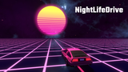](https://github.com/NightLifeDrive)

An endless racer where you take a chill drive on neon-lit streets while listening to synthwave music.

```
As team member of U-Knights:
Random track generation, object spawning, score counter, song display, name inputs,glowing materials, particle animations, bug fixes & documentation.
```

#
[Batr-E - Nikola's Journey (Unity / C#)](https://github.com/Batr-E_Nikolas_Journey)

[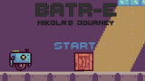](https://github.com/Batr-E_Nikolas_Journey)

In this Solarpunk puzzle plattformer, Nikola, a small repair robot, is assigned torebuild an old factory.

```
As team member of U-Knights:
Objects design, energy recharge interface, UI fixes & basic animations.
```

#
[Gamified Moodle (Moodle / HTML5)](https://github.com/GamifiedMoodle)

[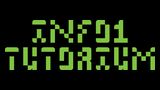](https://github.com/GamifiedMoodle)

Created a data-driven, enhanced, gamified Moodle course for tutoring. Using various plugins & web-design.
  
```
By me:
Idea, design, implementation, art retouch, UI, documentation`
```

#

<details>
<summary>🚧 <code>Works.In.Progress</code></summary>

[TowerDefense (Godot4 / GDscript2)](https://github.com/TowerDefense)

[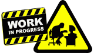](https://github.com/TowerDefense)

A different take on the tower defense genre, where towers don't kill but buff.
  
```
By me (probably):
Idea, design, implementation, UI, documentation
```

#
[Omnis Rewrite in Godot4 (Godot4 / GDscript2)](https://github.com/Omnis)

[](https://github.com/Omnis)

Rewriting and finishing the old Omnis project in Godot4. This should then finally work as expected and be future-proof. Might reuse doodle-art from 'I Can't C#'

#

[Rewrite my personal GitHub Page in (almost) CSS only (HTML5 / CSS3 / NO js!)](https://github.com/n-c0de-r.github.io)

[](https://github.com/n-c0de-r.github.io)

Making a new portfolio page, purely in HTML and CSS - hidden for now. Goal is to showcase enough, while still being a minimalistic, not bloated but fun experience. Also to train CSS, of course!

```
By me:
Idea, design, implementation, art retouch, UI, documentation.
```

</details>

<details>
<summary>📜 <code>Older.Projects</code></summary>

[Tauros Traps (Unity / C#)](https://github.com/TaurosTraps)

[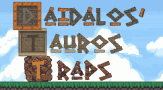](https://github.com/TaurosTraps)

Create and show perfect mazes to trap the mythological Tauros. Learned new algorithms in this assessment. Unfinished, could be a game.

```
By me:
Idea, design, implementation, art retouch, UI, documentation.
```

#
[Omnis (Godot3 / GDscript)](https://github.com/Omnis)

[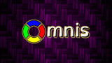](https://github.com/Omnis)

A more challenging recreation of the child's game "Simon" with new modes with accessibility in mind.

[Note: This entry becomes obsolete once the rewrite is done, replacing it]

```
By me:
Idea, design, implementation, art retouch, UI, documentation.
```

#
[Diving Game AI (Java)](https://github.com/DiveAI)

[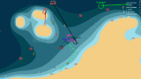](https://github.com/DiveAI)

Teaching an AI to dive and collect pearls in a predefined environment as part of the GameAI course.

```
By me:
Implementation, documentation.
```

#
[Notiply (Android / Java)](https://github.com/Notiply)

[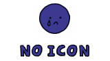](https://github.com/milanatran)

Just a prototype for a collaborative drawing Android app as part of the last Mobile Development course.

[Note: Sadly the code in the repo seems to be damaged an no app can be built from it. Needs a total overhaul!]
  
```
By me:
Idea, Implementation, UI, documentation, basic testing.
```

Some more below and [many others here...](https://github.com/n-c0de-r?tab=repositories)
</details>
