[](https://n-c0de-r.github.io)

## `About.Me`

| [Me by MilanaTran](https://github.com/milanatran") | Bio: |
|---|:---|
| [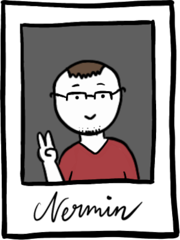](href="https://github.com/milanatran")  | Hi, I'm Nermin, also called Nico, holding a bachelor's degree [International Media & Informatics (IMI)](https://imi-bachelor.htw-berlin.de/) from [HTW Berlin - University of Applied Sciences](https://www.htw-berlin.de/).<br><br>Learning is the most important skill, and I believed that doing so in a playful, curiosity-driven way is the most effective and most natural. Therefore, I once aspired to a career in serious games. Games are also a cornucopia of software engineering topics; varied, versatile, challenging and engaging enough to never get bored.<br><br>Other than that I wanted to make real, useful software for people, such as backend solutions, web and cross platform apps - especially PWAs and Android. It seems though, the market is not in my favor now, so I'll stick to "dev" being my "hobby", and make the stuff I like - money and career isn't everything! :D<br><br>

###  <a href="mailto:n-c0de-r_contact@e.mail.de?subject=Hello from GitHub">`Click.Me(toMail)`</a>

<details>
      <summary>additional.info</summary>

- Into Web Dev, with experience in TypeScript & React (amongst many others). Would love to make more cross-platform web apps professionally.
- Experienced in Godot/GDScript & Unity/C#. Making "games" & prototypes as a training and artistic expression.
- Worked as a student tutor in '22 & '23, gaining experience in didactics, and expanding my skills, so I'll be able to design even greater gaming and learning opportunities.
- Worked as a development intern in '23 & '24 at [RisingPixel](https://github.com/RisingPixel) on the [Code Maze](https://embed-project.eu/game-en/) game​ for the [EMBED Project by the EU​](https://embed-project.eu/), creating a level editor for the core game.
</details>

<br />

###  `Knowledge.Set`


<br /><br />

---

## `Recent.Projects:`
For a more detailed description and implementation details, click the title or the icon to open the respective repo.

#
[Omnis (Godot4 / GDscript2)](https://github.com/n-c0de-r/Omnis4)

[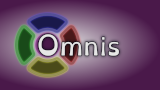](https://github.com/n-c0de-r/Omnis4)

A more challenging recreation of the child's game "Simon" with new modes and some accessibility in mind.

```
By me:
Idea (partially), design, implementation, art retouch, UI, documentation.
```

#
[GLYPHAE (Unity / C#)](https://github.com/n-c0de-r/GLYPHAE)

[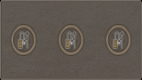](https://github.com/n-c0de-r/GLYPHAE)

GLYPHAE is an Android mobile game designed to make learning Ancient Egyptian hieroglyphs fun and engaging. Inspired by the Tamagotchi-style gameplay, players raise an Egyptian god from an egg to their godly form.

```
By me:
Idea, design, implementation, art retouch, UI, documentation.
```

#
[I Can't C# (Unity / C#)](https://github.com/ChariotGames/I-Cant-C-Sharp)

[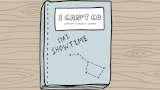](https://github.com/ChariotGames/I-Cant-C-Sharp)
No, it is NOT a C# learning app!<br>Part of the <a href="https://showtime.f4.htw-berlin.de">summer of '23 bachelor's showtime</a> project topic "Fostering concentration through minigames". But we flipped it and instead, we "challange" the concentration of the player.

```
As team member of Chariot Games:
Unity guidance, backend coding, code style & design, base game class, minigame manager, simon says game, bug fixing, code & scene cleanup, documentation, progress management.
```

#
<details>
<summary><code>Older.Projects</code></summary>

[MCE-Translator  (Unity / C#)](https://github.com/SilenceBreakers/NUI-MCE-Translator)

[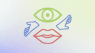](https://github.com/SilenceBreakers/NUI-MCE-Translator)

A Unity-based prototype application that allows users to use sign language gestures for vowels and numbers to translate them to text on screen and speech to audio.

```
As team member of SilenceBreakers:
Mostly backend work and Unity guidance, also programming a gesture recorder.
```

#
[WaveMaker (Unity / C#)](https://github.com/IMIaculate-Games/WaveMaker)

[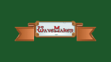](https://github.com/IMIaculate-Games/WaveMaker)

A reverse tower defense game for the topic "Reversed Roles" of <a href="https://itch.io/jam/gmtk-2023">GMTK Game Jam 23</a> where you create and play the waves.

```
As team member of IMIaculate-Games:
Random tower placement script, Unity teaching, GUI setup and editing, various bugfixes.
```

#
[StegaNotes (HTML5 / JS)](https://github.com/n-c0de-r/StegaNotes)

[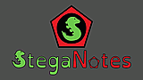](https://github.com/n-c0de-r/StegaNotes)

An offline-first, minimalistic Note-taking cross-platform PWA, that is able to hide texts using steganography. Made and works without frameworks or other heavy-weight "help" to reduce data load.

```
By me:
Idea, design, implementation, art retouch, UI, documentation.
```

#
[NightLifeDrive (Unity / C#)](https://github.com/n-c0de-r/NightLifeDrive)

[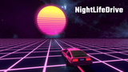](https://github.com/n-c0de-r/NightLifeDrive)

An endless racer where you take a chill drive on neon-lit streets while listening to synthwave music.

```
As team member of U-Knights:
Random track generation, object spawning, score counter, song display, name inputs,glowing materials, particle animations, bug fixes & documentation.
```

#
[Batr-E - Nikola's Journey (Unity / C#)](https://github.com/n-c0de-r/Batr-E_Nikolas_Journey)

[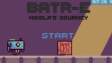](https://github.com/n-c0de-r/Batr-E_Nikolas_Journey)

In this Solarpunk puzzle plattformer, Nikola, a small repair robot, is assigned torebuild an old factory.

```
As team member of U-Knights:
Objects design, energy recharge interface, UI fixes & basic animations.
```

#
[Gamified Moodle (Moodle / HTML5)](https://github.com/n-c0de-r/GamifiedMoodle)

[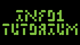](https://github.com/n-c0de-r/GamifiedMoodle)

Created a data-driven, enhanced, gamified Moodle course for tutoring. Using various plugins & web-design.
  
```
By me:
Idea, design, implementation, art retouch, UI, documentation`
```

#
[Tauros Traps (Unity / C#)](https://github.com/n-c0de-r/TaurosTraps)

[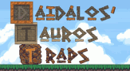](https://github.com/n-c0de-r/TaurosTraps)

Create and show perfect mazes to trap the mythological Tauros. Learned new algorithms in this assessment. Unfinished, could be a game.

```
By me:
Idea, design, implementation, art retouch, UI, documentation.
```

#
[Diving Game AI (Java)](https://github.com/n-c0de-r/DiveAI)

[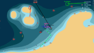](https://github.com/n-c0de-r/DiveAI)

Teaching an AI to dive and collect pearls in a predefined environment as part of the GameAI course.

```
By me:
Implementation, documentation.
```

#
[Notiply (Android / Java)](https://github.com/n-c0de-r/Notiply)

[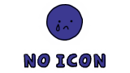](https://github.com/milanatran)

Just a prototype for a collaborative drawing Android app as part of the last Mobile Development course.

[Note: Sadly the code in the repo seems to be damaged an no app can be built from it. Needs a total overhaul!]
  
```
By me:
Idea, Implementation, UI, documentation, basic testing.
```

Some more below and [many others here...](https://github.com/n-c0de-r?tab=repositories)
</details>

<details>
<summary><code>Works.In.Progress</code></summary>

[TowerDefense (Godot4 / GDscript2)](https://github.com/n-c0de-r/TowerDefense)

[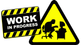](https://github.com/n-c0de-r/TowerDefense)

A different take on the tower defense genre, where towers don't kill but buff.
  
```
By me (probably):
Idea, design, implementation, UI, documentation
```

#
[Rewrite my personal GitHub Page in (almost) CSS only (HTML5 / CSS3 / NO js!)](https://github.com/n-c0de-r/n-c0de-r.github.io)

[](https://github.com/n-c0de-r/n-c0de-r.github.io)

Making a new portfolio page, purely in HTML and CSS - hidden for now. Goal is to showcase enough, while still being a minimalistic, not bloated but fun experience. Also to train CSS, of course!

```
By me:
Idea, design, implementation, art retouch, UI, documentation.
```

</details>
